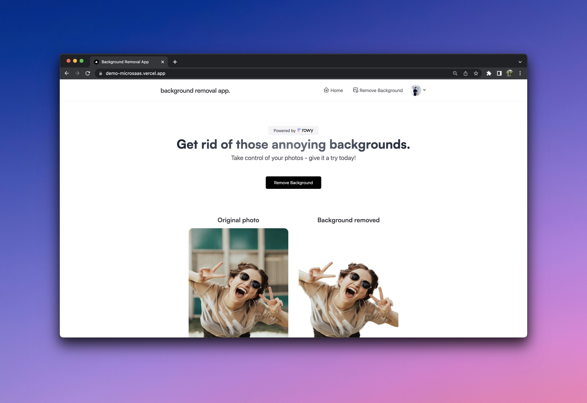

# AI MicroSaaS Template
## Background Removal App

This project allows users to remove the background from their photos using AI and comes integrated with Stripe payment. You can clone this project to create a AI MicroSaaS project and easily modify it for any usecase.

## Stack used

**App Frontend**: Next.js  
**Database**: Firebase  
**CMS**: Rowy  
**Auth**: Firebase Auth  
**Payment**: Stripe  
**CSS**: Tailwind  
**Usecase**: Subscription, SaaS, AI, MicroSaaS

### Try it here: [Live Demo](https://demo-microsaas.vercel.app/)

## How it works

This app uses the [modnet](https://github.com/pollinations/modnet) API via [Replicate](https://replicate.com/) to remove the background of images. Once users upload images, these images first gets stored to Firebase storage and then using low-code Cloud Functions built with [Rowy](https://www.rowy.io?ref=microsaas), the image's background is removed by making API call to Replicate which returns the photo with its background removed. 

User authentication is managed via Firebase Auth and managed easily on User management table of Rowy. All data such as user profile, generated images, and credit packges are stored in Firestore, while the associated stripe payment webhook and cloud functions are all managed in [Rowy](https://www.rowy.io?ref=microsaas).

This app also has Stripe payment integrated with webhooks built in low-code using Rowy, with the following plan that can be easily customized.
- Without account creation → 10 free credits
- With logged in users → unlock 100 credits along with ability to track paid users

## Get started quickly using fullstack template

### Frontend Template
1. Clone and deploy the Next.js App using Vercel's one click deploy link below
2. Add the .env variables as shown in the .env.local.example file 

One-Click deploy using [Vercel](https://vercel.com):

### Backend Template
1. Create an account on [Rowy](https://www.rowy.io?ref=microsaas)
2. On your workspace, create a Firebase project right from Rowy's guided UI.
3. Create a table from the `AI background remover` template - this will give you a guided setup experience to create database table for storing your app data including Firebase Auth authenticated users as well as steps to add [Replicate](https://replicate.com/) API key along with deploying pre-built backend Cloud Functions for Replicate and Stripe payments.
